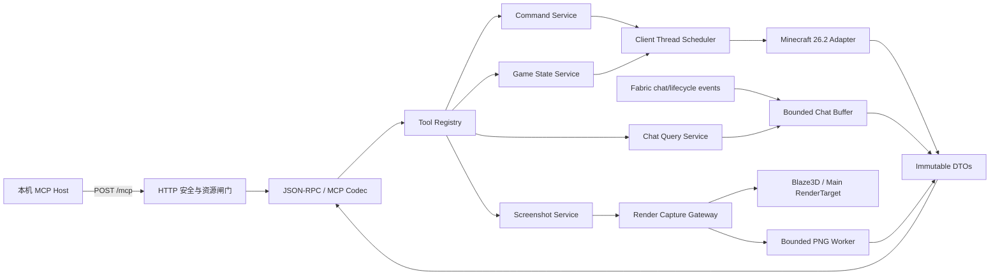
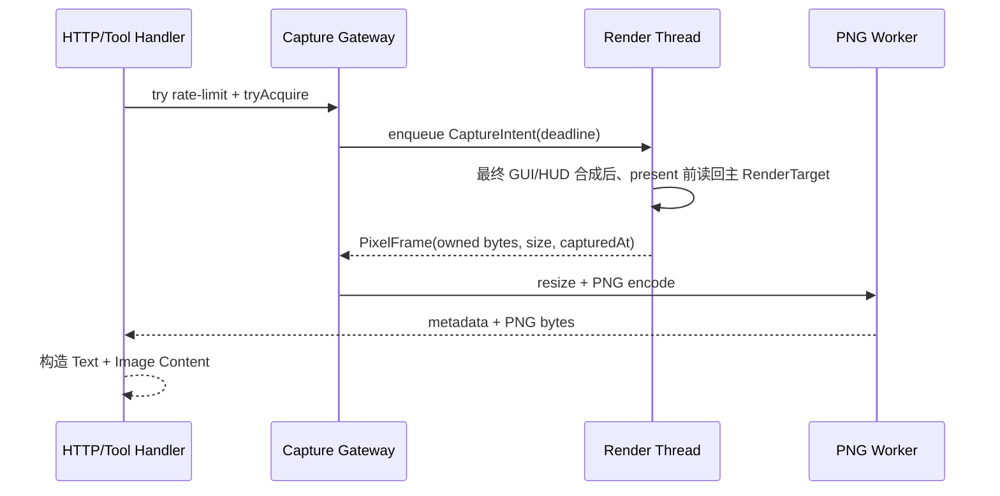

# MCMCP 技术架构与实现方案

- 文档状态：Accepted v1.0
- 方案确认日期：2026-09-05
- 对应需求：[PRD.md](./PRD.md) Draft v0.4
- 基线日期：2026-09-05
- 目标版本：Minecraft Java Edition 26.2 / Fabric Loader 0.19.3 / MCP 2026-07-28
- 目标读者：开发、测试、发布维护人员

## 1. 结论

首版采用**客户端内模块化单体**：一个 client-only Fabric 模组在 Minecraft 进程内启动本机 HTTP 服务，协议层和 Minecraft 适配层通过端口接口隔离。

核心选型如下：

| 领域 | 选型 | 结论 |
|---|---|---|
| 部署形态 | 单个 Fabric 客户端模组 JAR | 满足纯客户端、零服务端部署 |
| 协议实现 | 自实现 MCP 2026-07-28 最小子集 | 只实现 `server/discover`、`tools/list`、`tools/call` 和 4 个工具 |
| HTTP | Minecraft 已带 Netty，使用独立 EventLoop 和 Channel | 不复用游戏连接线程，不打包第二份 Netty |
| JSON | Minecraft 已带 Gson，外包一层严格解析器与显式 Codec | 不把 Gson/Minecraft 类型暴露到领域层 |
| 并发模型 | 异步 Future + 有界准入；禁止 I/O 线程阻塞等待游戏线程 | 请求全链路有 deadline 和取消令牌 |
| 游戏访问 | 客户端线程调度器 | 所有 world/player/connection 读取和命令发送均在客户端线程 |
| 截图 | 帧末窄范围 Hook + Blaze3D 后端抽象读回 + 单工作线程 PNG 编码 | 禁止裸 OpenGL；OpenGL/Vulkan 均需验收 |
| 聊天 | Fabric 接收消息事件优先；覆盖不足时替换为单一 HUD 入队点 Mixin | 事件方案与 Mixin 方案二选一，禁止双重捕获 |
| 状态 | 按请求采集不可变 DTO | 不缓存动态完整状态，不持有 Minecraft 对象引用 |
| 构建 | Java 25、Loom 1.17、Gradle 9.5.1、非混淆 26.2 工具链 | 所有版本写入版本目录并锁定 |

这一路线的关键原因是：截至本文日期，官方 Java MCP SDK 2.0.x 仍以 MCP 2025-11-25 为协议基线，不能直接满足 PRD 要求的 `server/discover`、无会话请求元数据和新请求头语义。首版协议面很小，自实现比改造旧 SDK 风险更可控。

## 2. 范围与设计原则

### 2.1 范围

本方案完整覆盖 PRD 首版的四项能力：

1. 提交一条斜杠命令；
2. 增量读取会话内聊天消息；
3. 按 section 获取结构化游戏状态；
4. 返回当前窗口 framebuffer 的 PNG 截图。

不实现旧版 MCP 初始化流程、SSE 长连接、协议 Session、鉴权、远程监听、普通聊天发送、键鼠控制、状态历史和截图落盘。

### 2.2 原则

- **线程正确优先**：Minecraft 对象不越过客户端/渲染线程边界。
- **边界处转 DTO**：跨线程只传不可变 JDK 值对象、字节数组或明确所有权的像素缓冲。
- **失败关闭**：配置异常、线程切换、生命周期变化或渲染状态不明时返回稳定错误，不猜测、不延迟执行副作用。
- **有界资源**：连接、请求、队列、聊天、截图、请求体和等待时间都有硬上限。
- **协议与游戏解耦**：MCP 层不知道 Minecraft 类；Minecraft 适配层不知道 JSON-RPC 封装。
- **最小 Mixin**：Fabric API 能覆盖时不用 Mixin；必须使用时只接入一个稳定语义点并配置注入断言。
- **可验证优先于技巧**：Schema、黄金响应、坐标公式、线程断言和截图像素均自动测试。

## 3. 候选方案

### 3.1 总体架构候选

| 方案 | 描述 | 优点 | 缺点 | 结论 |
|---|---|---|---|---|
| A. 客户端内模块化单体 | 模组内实现 HTTP、MCP 与 Minecraft 适配 | 单 JAR、低部署成本、延迟低、满足 PRD | 需自行实现小段协议；必须严守线程边界 | **推荐** |
| B. 官方 Java MCP SDK 内嵌 | 直接使用 SDK Server 与 HTTP Transport | 长期协议维护成本较低 | 当前 2.0.x 基线是 2025-11-25；依赖较多且存在游戏类路径冲突风险 | 暂不采用；SDK 原生支持 2026-07-28 后重评 |
| C. 模组 + 本机 Sidecar | 模组只做 IPC，外部进程提供 MCP | 协议与游戏进程隔离；HTTP 生态成熟 | 双进程安装、IPC 和生命周期复杂；违背首版“进程内 MCP Server”产品形态 | 不采用 |

### 3.2 HTTP 引擎候选

| 方案 | 优点 | 主要风险 | 结论 |
|---|---|---|---|
| Netty 独立管线 | 流式请求体上限、断连感知、背压、异步回写完善；Minecraft 已包含 | 与 26.2 自带版本耦合 | **推荐**；独立线程组，版本锁定，不复用游戏 Channel |
| JDK `HttpServer` | 代码量少、无第三方依赖 | 官方运行时可能裁剪 `jdk.httpserver`；等待异步游戏任务时难以及时感知断连 | 作为回退方案，仅在三平台验证满足取消语义后启用 |
| 内嵌 Jetty/Undertow | HTTP 行为成熟 | JAR 大、依赖和类加载冲突面扩大 | 不采用 |

### 3.3 JSON 与协议候选

| 方案 | 优点 | 主要风险 | 结论 |
|---|---|---|---|
| Gson + 显式严格解析/Codec | 零新增运行时依赖；精确控制 wire format | 需要自行拒绝重复键、尾随 token、非法数字和错误类型 | **推荐** |
| shade/relocate Jackson | 严格特性和 record 支持更好 | 增大包体与构建复杂度；需额外验证 Loom 打包 | Gson 无法满足严格性时的回退 |
| 手写完整 JSON Parser | 无依赖 | 安全与兼容风险不值得 | 不采用 |

### 3.4 工程拆分候选

首版选择**单 Gradle 模块、包级隔离**，而不是多模块构建。纯 Java 领域代码不能 import `net.minecraft.*`、`net.fabricmc.*` 或 Netty；通过 ArchUnit/静态规则守住边界。这样保持一个发布物，同时为以后拆分 `protocol-core` 留好接口。

## 4. 总体架构



### 4.1 分层

| 层 | 职责 | 禁止事项 |
|---|---|---|
| Transport | Socket、HTTP、Host/Origin、请求体限制、连接生命周期 | 不解析工具业务，不访问 Minecraft |
| MCP Protocol | JSON-RPC、请求头/`_meta` 一致性、方法路由、结果/错误封装 | 不依赖 Minecraft 类 |
| Application | 四个用例、deadline、取消、限流、错误归一化 | 不直接操作 framebuffer/网络包 |
| Domain | DTO、错误码、查询语义、环形缓冲算法 | 不依赖 Fabric、Netty、Gson |
| Minecraft Adapter | 26.2 API、Fabric 事件、Mixin、线程调度、Screen 映射 | 不构造 JSON-RPC 响应 |
| Infrastructure | 配置、时钟、ID、日志、指标、PNG 编码 | 不持有活动 world/player 引用 |

## 5. 运行时与线程模型

| 执行域 | 建议规模 | 工作内容 | 是否可访问 Minecraft 对象 |
|---|---:|---|---|
| Netty boss | 1 | 接受回环连接 | 否 |
| Netty I/O | 2 | HTTP 解码、Header Gate、异步写回、断连通知 | 否 |
| Protocol executor | 2，队列 16 | 严格 JSON 解析、Schema/语义校验、DTO 编码 | 否 |
| Deadline scheduler | 1 | 超时和取消信号 | 否 |
| PNG worker | 1，队列 1 | 缩放、色彩转换、PNG/Base64 | 否；只接收自有像素副本 |
| Minecraft client thread | 游戏提供 | 状态采集、连接校验、命令提交、UI 提示 | 是 |
| Render thread | 游戏提供 | 帧末 framebuffer 读回 | 只访问渲染对象 |

默认最多 8 个 application in-flight 请求。连接上限建议 32，TCP backlog 建议 32；每个连接只允许一个未完成请求，空闲 15 秒关闭。队列满时立即拒绝，绝不让 Netty EventLoop 或 Minecraft 线程等待队列空间。

### 5.1 跨线程任务协议

所有跨线程调用使用统一 `ScheduledCall<T>`：

```text
requestId + acceptedAt + deadlineNanos + lifecycleGeneration
+ CancellationToken + CompletableFuture<Result<T, ToolError>>
```

调度规则：

1. deadline 从 HTTP 请求通过安全闸门时开始计时，使用单调时钟；对外时间戳使用 UTC wall clock。
2. 客户端断连、超时或模组停止时设置取消令牌。
3. 客户端/渲染任务开始前检查取消状态；已取消的任务不得访问游戏对象。
4. 命令任务在副作用点前再次检查取消和 `lifecycleGeneration`。如果 deadline 已先完成，排队中的命令必须跳过，不能稍后“幽灵执行”。
5. 状态任务在客户端线程内一次性读完并立即转为 DTO，不保存 `Minecraft`、`Level`、`Player`、`Entity`、`BlockState` 等引用。
6. Future 的完成回调切回 Protocol executor 编码，再交给 Channel EventLoop 写响应，禁止在客户端/渲染线程序列化 JSON 或 Base64。

### 5.2 生命周期生成号

`ClientSessionTracker` 维护：

- `AtomicLong lifecycleGeneration`：join、disconnect、world/player 替换和 shutdown 时递增；
- 当前 `sessionId`：每次进入一个新的 play connection 生成 UUID v4，作为不透明字符串；
- 当前连接摘要：只保存可安全跨线程读取的不可变标识，不保存游戏对象。

聊天消息在事件发生时复制 `sessionId`。断开后保留缓冲区；下一次 join 更换 `sessionId`。命令用接收请求时的 generation 作为 fence，防止排队期间切服后误发到新会话。

## 6. 推荐工程结构

```text
.
├── build.gradle
├── gradle.properties
├── settings.gradle
├── src/main/java/dev/mcmcp/
│   ├── application/
│   │   ├── McpApplication.java
│   │   ├── ToolDispatcher.java
│   │   └── tools/
│   ├── domain/
│   │   ├── chat/
│   │   ├── error/
│   │   ├── state/
│   │   └── tool/
│   ├── protocol/
│   │   ├── JsonRpcCodec.java
│   │   ├── McpRequestValidator.java
│   │   ├── McpResponses.java
│   │   └── ToolCatalog.java
│   ├── transport/netty/
│   │   ├── LoopbackMcpServer.java
│   │   ├── HttpSecurityGate.java
│   │   └── RequestBodyGate.java
│   ├── chat/BoundedChatBuffer.java
│   ├── screenshot/
│   │   ├── PixelFrame.java
│   │   └── PngEncoder.java
│   ├── config/McmcpConfig.java
│   └── observability/
├── src/client/java/dev/mcmcp/client/
│   ├── McmcpClient.java
│   ├── minecraft/
│   │   ├── MinecraftClientScheduler.java
│   │   ├── MinecraftStateAdapter.java
│   │   ├── MinecraftCommandAdapter.java
│   │   ├── MinecraftScreenshotAdapter.java
│   │   ├── ScreenIdMapper.java
│   │   └── ClientSessionTracker.java
│   └── screenshot/FrameCaptureGateway.java
├── src/main/resources/
│   ├── fabric.mod.json
│   ├── mcmcp.mixins.json
│   └── mcmcp/schema/
│       ├── execute-command-input.json
│       ├── execute-command-output.json
│       ├── get-chat-input.json
│       ├── get-chat-output.json
│       ├── get-game-state-input.json
│       ├── get-game-state-output.json
│       ├── capture-screenshot-input.json
│       └── capture-screenshot-output.json
└── src/test/
    ├── java/
    └── resources/golden/
```

Loom 启用 split environment source sets，并把 `main` 与 `client` 合并为同一个 mod。`main` 放纯 Java 领域/协议/基础设施，`client` 是唯一允许引用 Minecraft/Fabric client API 的源集。`fabric.mod.json` 必须声明 `environment: "client"`，Minecraft 版本使用精确 `26.2`，而不是 `^26.2`；首版不对 26.3 作兼容承诺。

### 6.1 初始版本锁

| 依赖 | 首次实现候选 | 规则 |
|---|---|---|
| Java toolchain | 25 | Gradle JVM 与 `--release` 一致 |
| Minecraft | 26.2 | 精确锁定 |
| Fabric Loader | 0.19.3 | 精确锁定 |
| Fabric Loom | 1.17 | 使用非混淆插件 `net.fabricmc.fabric-loom` |
| Gradle Wrapper | 9.5.1 | Wrapper 校验和入库 |
| Fabric API | 0.155.0+26.2 | 当前 26.2 候选；Phase 0 编译/运行通过后冻结 |

构建启用 Gradle dependency locking 和 verification metadata。Netty/Gson 的实际版本由 Minecraft 26.2 解析结果确定并记录；不得在成品 JAR 内再嵌入另一份同包名实现。测试库也必须固定版本，但不进入运行时 JAR。

## 7. 启动与停止

### 7.1 启动顺序

1. Fabric client entrypoint 注册 lifecycle、play connection、聊天和帧末 hook。
2. 读取 `config/mcmcp.json`。文件不存在时原子创建默认配置；不能解析或越界时 fail closed：不启动 HTTP，并在日志与游戏内各提示一次。
3. 初始化静态系统信息、Schema 资源和固定 Tool Catalog；启动时自检所有 Schema 可解析且工具顺序正确。
4. `ClientLifecycleEvents.CLIENT_STARTED` 后，若 `enabled=true`，用字节形式构造 `127.0.0.1` 地址并绑定端口。
5. 绑定成功后记录版本、监听地址、端口以及“无鉴权”警告；主菜单状态下服务立即可用。

### 7.2 停止顺序

1. 停止接受新连接；
2. 取消尚未开始的请求和截图；
3. 关闭活动 Channel；
4. 停止 PNG、协议、deadline 和 Netty 线程组；
5. 释放仍由模组持有的 GPU readback/NativeImage/ByteBuf；
6. `stop()` 幂等，多次调用不重复报错。

端口占用只使 MCP 服务不可用，不中断 Minecraft。不得后台重试抢占端口。

## 8. HTTP 与安全管线

推荐 Channel Pipeline：

```text
HttpServerCodec
→ RequestHeaderGate
→ HttpObjectAggregator(1 MiB)
→ InFlightGate(8)
→ ProtocolDispatchHandler
```

### 8.1 头部阶段

在聚合请求体前完成能完成的拒绝：

- 本地 socket 只绑定字面量 `127.0.0.1`；不调用 hostname 解析决定绑定地址；
- raw path 必须精确等于固定的 `/mcp`，不接受路径前缀、尾斜杠或 query；
- `/mcp` 只接受 `POST`，其他方法返回 405；其他路径返回 404；
- `Host` 必须且只能出现一次，值精确为 `127.0.0.1:<port>` 或大小写不敏感的 `localhost:<port>`；拒绝用户信息、尾点、IPv6、缺省端口和逗号拼接；
- 只要出现任意 `Origin` 头就返回 403，包括空值和 `null`；
- 不发送 `Access-Control-Allow-*`；
- `Content-Type` 只接受 `application/json`，可带 UTF-8 charset；
- `Accept` 必须有 q 值非 0 的 `application/json` 和 `text/event-stream`；
- 拒绝非 identity 的 `Content-Encoding`；
- `Content-Length > 1 MiB` 立即 413；chunked body 由聚合器执行同一硬上限；
- 多个冲突的 `Content-Length`、非法 Transfer-Encoding 或畸形 header 直接 400 并关闭连接。

安全拒绝不回显 Host、Origin、请求体或命令。响应添加 `Cache-Control: no-store`；`server/discover` 和 `tools/list` 的 MCP 结果仍按 PRD 返回自己的 `ttlMs/cacheScope`。

### 8.2 连接与背压

- 全局活动连接上限 32、in-flight 请求上限 8；
- 同一连接只允许一个处理中请求，拒绝 HTTP pipelining；
- 请求读取超时 5 秒，空闲连接 15 秒关闭；
- Protocol executor 队列满时返回 503 并关闭连接；
- 全局请求限流采用 token bucket，容量和每秒补充量均为 `requests_per_second`；
- 截图另有容量 1 的 token bucket 和 `Semaphore(1)`，先限频、再抢独占锁；
- 限流、并发闸门均在进入 Minecraft/渲染线程前生效。

对已经成功解析的 `tools/call`，工具限流返回 HTTP 200 的 `RATE_LIMITED` Tool Result；对 discover/list 的总限流返回 HTTP 429、JSON-RPC code `-32000`，并在 `error.data` 返回 `code:"RATE_LIMITED"` 和 `retryable:true`。`-32000` 位于 MCP 留给实现方的 `-32000..-32019` 范围。连接/执行器在解析前过载时允许返回 HTTP 503 且无业务错误对象。

## 9. MCP 2026-07-28 协议实现

### 9.1 支持面

仅支持：

- 单 JSON-RPC 2.0 Request；不支持 batch；
- `server/discover`；
- `tools/list`，无分页；
- `tools/call`；
- `application/json` 单次响应。

不实现 `initialize`、`notifications/initialized`、GET SSE、DELETE Session、`Mcp-Session-Id`、`subscriptions/listen` 和任何未声明 capability。若收到旧版 Session/Last-Event-ID 头可忽略，但请求仍必须通过 2026-07-28 元数据校验。

### 9.2 严格解析

`StrictJsonReader` 基于 pinned Gson streaming API，必须：

- 只接受一个顶层 object；
- 拒绝重复 object key；
- 拒绝尾随 token、注释、NaN、Infinity 和超深嵌套（上限 64）；
- JSON-RPC `id` 只接受 string 或整数，不接受 `null`、小数、boolean；
- 保留 Unicode；输出前把孤立 surrogate 替换为 U+FFFD；
- 不使用 Gson 反射直接序列化 Minecraft 对象。

### 9.3 校验顺序

```text
HTTP method/path/security/content headers
→ body size
→ strict JSON
→ JSON-RPC envelope
→ MCP-Protocol-Version 与 params._meta
→ Mcp-Method 与 body.method
→ tools/call 的 Mcp-Name 与 params.name
→ method params
→ tool input shape
→ tool semantic rules
→ application handler
```

必须区分 `Mcp-Name` 缺失/不一致、方法不存在、工具不存在、Schema 错误和游戏业务错误。协议错误不进入任何游戏线程。

`Mcp-Method` 与 `Mcp-Name` 按 HTTP field-value 规则读取；header 名大小写不敏感。`Mcp-Name` 若使用 MCP 规定的 Base64 sentinel encoding，必须先严格解码再与 `params.name` 比较；畸形编码或解码后不一致都返回 `-32020 HeaderMismatch`。四个已公布工具名本身均为安全 ASCII，服务端响应不需要编码。

### 9.4 固定发现结果

`server/discover`：

- `supportedVersions = ["2026-07-28"]`；
- `capabilities = {"tools":{"listChanged":false}}`；
- `_meta["io.modelcontextprotocol/serverInfo"] = {name:"mcmcp", version:<mod-version>}`；
- `resultType = "complete"`、`ttlMs = 3600000`、`cacheScope = "public"`；
- `instructions` 强调命令只代表 submitted、用聊天读取反馈、大规模修改先确认。

`tools/list` 从 classpath 中的只读 Schema 文件创建一次固定结果，严格保持 PRD 顺序。返回前不动态读取游戏状态，因此可安全缓存且不会因连接状态改变。

`tools/list` 的请求只接受标准 `_meta` 和缺省/空 cursor；服务端从不返回 `nextCursor`。客户端不应构造服务端未签发的 cursor，收到非空 cursor 时返回 `-32602 Invalid params`。

### 9.5 Schema 单一事实源

八个 JSON Schema 文件作为公开契约的单一事实源，工具目录直接加载它们，测试再用同一文件校验 DTO 黄金样例。规则：

- dialect 为 JSON Schema 2020-12；
- 所有固定 object 都有 `additionalProperties:false`；
- `sections` 和 `types` 使用 `uniqueItems:true`；
- 所有 enum、范围和 required 字段与 PRD 一致；
- 可为 `null` 的字段在 Schema 中显式声明；
- game-state 未请求的 section 为 optional property，而 section 一旦出现，其内部固定字段必须齐全；
- screenshot outputSchema 只描述元数据，不包含 Base64；
- 错误 Tool Result 不带 `structuredContent`，因此不套成功 outputSchema。

CI 校验 `tools/list` 中 Schema 与资源文件结构相等，防止代码和文档漂移。

### 9.6 Tool Result 编码

所有成功结果统一由 `ToolResultFactory` 构造：`resultType:"complete"`、`isError:false`、符合 outputSchema 的 `structuredContent`，以及至少一个与其 JSON 数据语义相同的 Text Content。JSON 使用稳定字段顺序和 UTF-8，但客户端不得依赖对象成员顺序。

截图结果的 `structuredContent` 和 Text Content 都只含元数据，另加一个 `{type:"image", mimeType:"image/png", data:<base64>}` 内容块。错误结果只含序列化 `{error:{code,message,retryable}}` 的 Text Content、`resultType:"complete"` 与 `isError:true`，不得带 `structuredContent`。

## 10. 错误映射

| 阶段 | HTTP | JSON-RPC / Tool Result |
|---|---:|---|
| Origin/Host 拒绝 | 403 | 可无 body；不得包装成工具错误 |
| 错误 method/path | 405/404 | 非 MCP 路径可无 body |
| 请求体过大 | 413 | 可返回无 id 的 JSON-RPC error |
| discover/list 总请求限流 | 429 | `-32000`，data 含 `RATE_LIMITED`、`retryable:true` |
| 解析前资源过载 | 503 | 可无 JSON-RPC body；关闭连接 |
| JSON 解析失败 | 400 | `-32700 Parse error` |
| JSON-RPC envelope 错误 | 400 | `-32600 Invalid Request` |
| Header 缺失或与 body 不一致 | 400 | `-32020 HeaderMismatch` |
| 不支持的协议版本 | 400 | 规范 `UnsupportedProtocolVersionError`，data 列出 `2026-07-28` |
| 未实现 RPC method | 404 | `-32601 Method not found` |
| 工具未知或 inputSchema 失败 | 200 | JSON-RPC `-32602 Invalid params` |
| 语义/游戏/超时错误 | 200 | `resultType:complete`、`isError:true`、Text Content 错误对象 |
| 未分类协议内部异常 | 500 | JSON-RPC `-32603 Internal error`，不暴露堆栈 |

Tool Error 使用 PRD 的 10 个稳定 code。内部异常先映射到领域错误，再由 MCP 层封装。日志保留 `request_id/method/tool/duration_ms/result/error_code`，不记录命令、聊天、图片或状态正文。

## 11. 四个工具的实现

### 11.1 `minecraft_execute_command`

流程：

1. Protocol executor 校验参数对象只有 `command`；
2. 业务校验原字符串无首尾空白、以 `/` 开头；
3. 仅移除第一个 `/`，用 Java `String.length()` 校验余下长度为 1–256；
4. 拒绝 CR/LF/NUL、`§`、控制字符以及 26.2 原版判定为非法的聊天字符；
5. 捕获当前 lifecycle generation 并调度到客户端线程；
6. 客户端线程再次检查 cancellation、generation、player、world、connection；
7. 调用 26.2 官方客户端连接的高层 `sendCommand` 等效入口，让原版完成解析、签名参数准备和发送；禁止直接构造命令 packet；
8. 高层调用正常返回后记录 `submitted_at` 并完成 Future；
9. 在客户端线程显示不含命令文本的非阻塞提示，例如“`MCMCP submitted a command`”。

`//wand` 去掉第一个 `/` 后发送 `/wand`，不能被改写为 `wand`。成功只返回 `submitted`。如客户端侧签名或参数准备失败，返回 `COMMAND_REJECTED`，不降级发包。

取消与副作用的线性化点是调用原版发送入口之前的最后一次 compare/check。该点之后即使 HTTP 客户端断开，也只能完成发送，不能承诺撤销。

### 11.2 `minecraft_get_chat_messages`

#### 捕获策略

首选 `ClientReceiveMessageEvents`：玩家聊天映射为 `chat`；game/system 消息仅在实际进入聊天 HUD 且不是 action bar 时映射为 `system`。先用 Spike 验证命令反馈、服务器系统消息、签名聊天和本地系统消息。

若 Fabric 事件不能覆盖“所有进入 Chat HUD 的消息”，改用一个对统一 HUD 入队点的 Mixin。此时关闭事件写入，只保留单一 producer；Mixin 只复制最终显示 `Component`，不改变消息。

#### 缓冲结构

`BoundedChatBuffer` 使用预分配数组环，写入由客户端事件线程执行；查询使用短持有时间的 `StampedLock`/读写锁复制 DTO：

- ID 从 1 开始，用 `AtomicLong` 单调递增；
- 容量启动时固定为 100–10000；
- 保存 `oldestId/newestId/lastEvictedId/evictedCount`；
- 同文本不去重；
- `plain_text = component.getString()` 的等效纯文本，再做非法 surrogate 清理；
- 不保存 Component、Style、签名或点击/悬浮事件；
- 结果复制后释放锁，再做 JSON 编码。

查询语义：

- 无 `after_id`：过滤后取最近 `limit` 条，再按 ID 升序返回；
- 有 `after_id`：过滤后取最早 `limit` 条 `id > after_id` 的消息；
- `has_more` 只针对当前 types 过滤后的剩余可用消息；
- `gap_detected = after_id != null && lastEvictedId > after_id`；
- 空缓冲时 `oldest_available_id`、`newest_available_id`、`next_after_id` 均为 `null`，但若提供 `after_id`，`next_after_id` 等于它；
- `evicted_message_count` 是进程级累计值，直到客户端退出才归零。

上述空缓冲行为是 PRD 未明确处的实现决定，应在冻结公开 Schema 时同步补入 PRD。

### 11.3 `minecraft_get_game_state`

#### 一致性边界

整个动态快照在一个客户端线程 task 内完成。开始时读取 `world`、`player`、generation；结束前再次比对引用和 generation。发生变化时不返回半旧半新的 DTO：返回 `ready=false` 的客户端/连接状态，世界相关 section 为 `null`。

静态系统信息在启动时缓存；只能从渲染设备取得的 GPU/backend 字段在渲染器就绪后于正确线程惰性采集一次。帧统计由渲染侧发布不可变 `RenderMetricsSnapshot`。未请求 section 完全不采集，避免无谓访问区块、标签和渲染器。

#### 字段来源策略

| Section | 首选来源 | 降级规则 |
|---|---|---|
| client | Minecraft version、FPS、`minecraft.gui` 当前 Screen、window/options | 无 GUI 用 `null`；未知 Screen 用类全名 |
| connection | 当前 connection、singleplayer server、server data/Realms 标记、player info latency | 不能可靠区分用最接近 type；不可得字段 `null` |
| player | LocalPlayer 的位置、旋转、状态、属性、背包选中项、effect | 空手为 `null`；effect 按资源 ID 排序 |
| world | ClientLevel、dimension key、玩家位置 biome、difficulty、weather/light | 客户端未同步的数据 `null`，禁止推测 |
| debug.coordinates/facing | 同一份 player position/rotation 派生 | 负坐标只用 floor 运算 |
| debug.chunk | 玩家所在客户端 LevelChunk/heightmap/difficulty | chunk 不可用时 `loaded=false`，其余 nullable |
| debug.render | 原版调试渲染器公开计数 + 1 秒帧时采样器 | 无稳定 API 的计数返回 `null` |
| debug.system | JVM Runtime、Window、Blaze3D renderer/device 公开字符串 | 不读取用户名、路径、序列号、额外 IP |
| target | 当前 HitResult + Block/Fluid state + registry/tag；EntityHitResult | 只返回客户端可见值，不读取 NBT |

坐标只计算一次并复用到 `player` 和 `debug`：

```text
blockX = floor(position.x)
chunkX = floorDiv(blockX, 16)
inChunkX = floorMod(blockX, 16)
chunkOriginX = chunkX * 16
regionX = floorDiv(chunkX, 32)
```

Y/Z 同理；region 只有 X/Z。所有 properties/tags/status effects 用资源 ID 或属性名排序，保证确定性输出。

`FrameTimingSampler` 在帧完成处将真实帧间隔写入固定大小 primitive ring，并按最近 1 秒样本计算平均值；不得用 `1000 / fps` 代替。采样器不分配对象、不生成 JSON，避免稳定运行时 GC 压力。

Screen 映射用显式 `instanceof` 表实现 PRD 的 12 个稳定值。第三方/未知类输出 `class:<fully-qualified-class-name>`；不得用标题文字或本地化文本判断。

### 11.4 `minecraft_capture_screenshot`

截图是最高技术风险模块，必须在 OpenGL 和 Vulkan 各完成一次 Spike 后再冻结实现。

推荐数据流：



实现约束：

- 帧末 Hook 必须位于 HUD、聊天和当前 Screen 已合成之后、swap/present 之前；
- 只在有 pending request 时读回，空闲时不复制 framebuffer；
- 通过 Blaze3D/RenderTarget/GPU abstraction 执行读回，禁止 `glReadPixels` 或其他裸 OpenGL；
- GPU readback 完成后转成由模组独占的紧凑 RGBA/RGB 字节，立即释放游戏/GPU 资源；
- `PixelFrame` 实现 `AutoCloseable`，每条成功、异常、取消路径都关闭；
- `captured_at` 是像素所对应帧的捕获时刻，不是 PNG 编码完成时间；
- `max_width` 只缩小，目标高度按长宽比四舍五入且至少 1；
- PNG worker 负责方向翻转、通道次序、缩放、sRGB PNG 和 Base64；渲染线程不做这些工作；
- 最小化、0 尺寸、context/device lost 或 deadline 到期返回 `SCREENSHOT_UNAVAILABLE`/`TIMEOUT`；
- 同时只能有一个 intent；第二个请求立即 `BUSY`，不排队；
- 响应结束后清除 PNG/Base64 引用，不缓存历史帧。

编码首选使用 Minecraft 已带 NativeImage/STB 能力；若不能明确写出 sRGB 且无文件落盘，则使用 JDK ImageIO 内存编码并显式设置 PNG sRGB metadata。两条路径都必须用像素黄金测试和 1080p 基准决定，不能仅凭 API 可调用就选定。

## 12. 配置

`McmcpConfig` 是不可变 record，严格接受 PRD 的 6 个字段。生产构建不提供 endpoint、host、CORS、Origin bypass、auth bypass 等隐藏字段；MCP 路径固定为 `/mcp`。

加载策略：

- 文件不存在：写临时文件、fsync/close 后原子 rename 为默认配置；
- JSON 错误、重复字段、未知字段、错误类型或数值越界：不启动服务，提示用户修复；
- MCP endpoint 不从文件、环境变量或 JVM 参数读取，固定为 `/mcp`；
- 所有值只在启动读取一次；
- 日志可以记录配置文件路径和端口，但不记录任何请求数据。

内部资源上限（连接 32、in-flight 8、协议队列 16、PNG 队列 1）首版作为常量，不对用户暴露，避免形成未经测试的调优面。

## 13. 可观测性与玩家提示

### 13.1 结构化日志字段

```text
event, request_id, rpc_method, tool_name, duration_ms,
result_class, error_code, http_status, queue_wait_ms
```

命令工具只额外记录 `command_java_length`；聊天只记录返回条数和 ID 范围；截图只记录尺寸与编码耗时；状态只记录 requested sections。异常日志先通过协议边界清洗，禁止把 DTO、body 或异常中携带的命令内容输出。

### 13.2 指标

首版不开放网络 metrics endpoint，仅在 DEBUG 日志或测试探针维护：

- request count / active / rejected；
- client-thread queue wait 和 execution time；
- screenshot readback、resize、encode、Base64 时间；
- chat size / evicted count；
- timeout / cancellation / late-completion count。

### 13.3 玩家提示

- 每次进入世界首次提示：本机程序可读取聊天、状态和画面，并能以玩家身份提交命令；
- 每次命令提交成功显示不含命令内容的短提示；
- 端口绑定或配置失败只提示一次；
- 提示 API 由 `UserNotifier` 封装，避免与聊天捕获形成重复/递归写入。命令提示优先用 action bar 或专用 HUD element，不写入 Chat Buffer。

## 14. 性能与内存预算

| 路径 | 主线程预算 | 端到端目标 | 分配策略 |
|---|---:|---:|---|
| chat append | 单次 < 0.1 ms | 事件内完成 | 只复制纯文本与小 DTO |
| chat query | 无主线程工作 | P95 < 100 ms | 锁内只复制引用/DTO |
| state | P95 < 1 ms | P95 < 100 ms | 按 section 采集；集合有界且排序 |
| command | P95 < 1 ms | P95 < 100 ms | 只校验状态并调用原版入口 |
| screenshot readback | 目标 < 4 ms CPU 提交时间；GPU 等待单测量 | 1080p P95 < 500 ms | 单帧、单请求、及时 close |

内存上限估算：

- 1000 条聊天按平均 1 KiB 纯文本及对象开销，目标 < 2 MiB；
- 首版输出宽度硬上限 3840；典型 3840×2160 RGBA 原始帧约 31.6 MiB。编码期间最多允许一个原始帧、一个缩放帧、一个 PNG 和一个 Base64 表示；
- 禁止通用 buffer cache 无限扩张；只复用固定上限且所有权明确的缓冲；
- 2 小时 soak 中，以 warm-up 后堆占用回归线和 GC 后 live set 判定持续增长，而不是只看进程 RSS。

若 4K 最坏路径峰值过高，优先在 GPU/CPU readback 阶段直接生成目标宽度（前提是 Blaze3D 支持且两后端一致），不改变对外接口。

## 15. 测试方案

### 15.1 纯单元测试

- `StrictJsonReader`：重复键、尾随 token、深度、Unicode、非法数字、1 MiB 边界；
- Header/Accept/Host/Origin 矩阵，包括大小写、重复头、q=0、chunked；
- JSON-RPC ID、错误码、header/body mismatch、可选 `clientInfo`；
- 8 份 Schema 的正反例和 golden `tools/list`；
- command 长度、`//`、空白、控制字符、surrogate、非法游戏字符；
- ring buffer 淘汰、过滤、分页、gap、空缓冲、多 session；
- 坐标 property test：负数、16/32 边界、世界高度边界；
- section 省略和 null 规则；
- deadline/断连/队列取消竞态，尤其确保 timed-out queued command 不会发送；
- rate limiter 使用 fake monotonic clock，测试边界不 sleep。

### 15.2 协议集成测试

在 `127.0.0.1` 随机端口启动真实 Netty Server，Minecraft ports 使用 fake：

- 完整 discover/list/call 请求和响应快照；
- HTTP status 与 JSON-RPC/Tool Error 分层；
- 慢 body、超大 chunked body、客户端中途断开、并发 9/截图并发 2；
- 服务 stop 后端口释放、Future 取消、线程终止；
- MCP Inspector 使用固定 25585 做发布前人工/自动冒烟。

### 15.3 Minecraft 集成与 GameTest

- 主菜单、加载、游戏、暂停、死亡、断线的状态矩阵；
- 单人、LAN、无权限多人、有权限多人和 signed argument 命令；
- 玩家/系统/命令反馈各捕获一次，action bar 不捕获；
- 维度切换、死亡重生、快速断开重连时 generation fence；
- block/fluid/entity/miss target 与 F3 对照；
- 12 个 Screen 映射及第三方 Screen fallback；
- OpenGL/Vulkan 截图的方向、RGBA、HUD、聊天、GUI、缩放、最小化；
- Sodium 等常见渲染优化模组的兼容冒烟，具体版本写入测试报告。

### 15.4 非功能测试

- 2 小时 soak：10 次/秒混合 state/chat，1 次/秒 screenshot，周期切世界；
- JFR/Profiler 统计每 tick 新增耗时 P95、队列等待、对象分配和 live set；
- 1920×1080 截图 P95 < 500 ms，状态/聊天 P95 < 100 ms；
- macOS/Windows/Linux 各做官方启动器运行时冒烟；
- 模糊测试 HTTP decoder 后的 JSON 与工具参数；
- 测试构建开启 Netty leak detection，确保 ByteBuf 零泄漏。

## 16. 验收追踪

| PRD 验收域 | 主要实现点 | 自动化/证据 |
|---|---|---|
| 14.1 MCP 与网络 | Header Gate、Strict Codec、Tool Catalog | 协议集成、raw HTTP 安全矩阵、Inspector 报告 |
| 14.2 命令 | generation fence、原版高层发送入口 | fake 竞态测试 + 单/多人实测 |
| 14.3 聊天 | 单 producer 环形缓冲 | ring property tests + HUD 消息矩阵 |
| 14.4 状态 | 单客户端任务不可变快照 | 坐标 property tests + F3 对照表 |
| 14.5 截图 | 帧末 hook、后端抽象、PNG worker | 像素 golden + 两后端/三平台报告 |
| 14.6 端到端 | 四工具组合 | 一次性世界案例记录 |
| 14.7 回归 | OS/连接/UI/优化模组矩阵 | 发布 checklist 与版本化报告 |

## 17. 实施阶段与交付门

### Phase 0：技术 Spike（必须先完成）

1. 创建最小 26.2 client mod，锁定 Java/Loom/Gradle/Loader/Fabric API；
2. 验证 Minecraft 运行时 Netty/Gson 版本和可用 API；
3. 验证 `ClientReceiveMessageEvents` 对聊天 HUD 的覆盖与 action bar 区分；
4. 验证原版高层命令入口对普通命令、`//` 和 signed argument 的行为；
5. 找到完整 GUI 合成后的稳定帧末 hook，并用 Blaze3D 分别读回 OpenGL/Vulkan；
6. 列出全部状态字段的 26.2 API 映射，标明稳定、需 accessor、只能 nullable。

退出条件：四项核心能力均有最小可运行证明；截图无裸 OpenGL；任何必需 Mixin 都已定位到单一注入点。

### Phase 1：工程与协议骨架

- Gradle、CI、client-only metadata、配置；
- Netty loopback server、资源闸门、严格 JSON-RPC；
- discover/list、Schema 资源、错误映射；
- fake ports 的协议集成测试。

退出条件：无需进入世界即可通过 Inspector discover/list；全部非法 HTTP/协议用例通过。

### Phase 2：生命周期、聊天与命令

- session/generation tracker；
- chat producer 和 buffer；
- command validator、scheduler、原版发送适配；
- 玩家风险提示。

退出条件：单/多人命令提交与反馈读取闭环；超时命令无延迟副作用。

### Phase 3：状态快照

- client/connection/player/world；
- debug/target、排序、Screen 映射；
- frame sampler 与静态系统缓存。

退出条件：PRD 字段矩阵、负坐标和生命周期竞态测试通过；不可得字段均为 null。

### Phase 4：截图

- 帧末 capture gateway；
- backend-neutral readback、缩放、sRGB PNG；
- 并发、限频、取消和资源回收。

退出条件：OpenGL/Vulkan 像素测试与 1080p 性能目标通过，最小化/异常路径无泄漏。

### Phase 5：硬化与发布

- 2 小时 soak、三平台、连接类型、优化模组回归；
- README、MCP Host 配置、隐私/副作用警告、许可证；
- 可复现构建、依赖锁、JAR 验证、验收报告。

退出条件：PRD 14、15 节 checklist 全部有结论；未通过项不得静默发布。

## 18. 关键风险与决策门

| ID | 风险 | 决策门/处理 |
|---|---|---|
| R1 | Netty/Gson 属于游戏携带依赖而非 MCMCP 自有 API | Phase 0 固定版本并做启动测试；若缺失/不满足严格性，切换 JDK HTTP 或 relocated Jackson |
| R2 | 官方 MCP Java SDK 尚未跟上 2026-07-28 | 首版不引入；只有 SDK 支持 discover/new headers 且依赖审计通过才重评 |
| R3 | Fabric 消息事件漏掉部分 HUD 消息 | 事件覆盖测试不过就切换统一 HUD 入队 Mixin，禁止双写去重补救 |
| R4 | 26.2 OpenGL/Vulkan readback API 不统一 | 截图作为独立 gateway；任一官方后端失败则不能宣称完整首版 |
| R5 | render pipeline 多线程导致捕获半帧 | 只在最终合成与 present 之间接入，像素序列测试验证 |
| R6 | debug 计数无稳定访问点 | 用最小 accessor 或返回 null；绝不解析本地化 F3 文本 |
| R7 | 本机任意同账户进程可调用命令 | 回环/Host/Origin/限流/可见提示；README 明示残余风险 |
| R8 | 截图峰值内存和掉帧 | 单并发、按需读回、早缩放、所有权跟踪、JFR/JMH 基准 |

## 19. 已确认的契约补充

以下决定已于 2026-09-05 随推荐方案一并确认，并同步进入 PRD：

1. 空聊天缓冲时 `oldest_available_id` 和 `newest_available_id` 为 `null`；提供 `after_id` 时，空结果的 `next_after_id` 仍等于输入值；
2. `session_id` 是不透明 UUID v4 字符串，不提供排序语义；
3. endpoint 固定为 `/mcp`，从配置中删除；
4. game-state 始终要求 `captured_at`、`game_tick`、`ready`；请求的 section 对应顶层属性必须出现，未请求的必须省略；section 为对象时其固定子字段全部 required，PRD 标明不可得的字段显式 nullable；
5. 截图输出宽度硬上限 3840、并发 1，不缓存；未传 `max_width` 等价于 3840；
6. 已解析的 `tools/call` 限流使用 `RATE_LIMITED` Tool Result；discover/list 总限流使用 HTTP 429 和实现定义 JSON-RPC code `-32000`，`data.code="RATE_LIMITED"`、`data.retryable=true`；解析前过载使用 HTTP 503。

## 20. 完成定义

实现完成需同时满足：

- 代码边界和线程断言通过；
- MCP Inspector 发现并调用全部 4 个工具；
- PRD 所有 Schema/错误/生命周期/安全用例有自动测试；
- OpenGL、Vulkan 及三平台结果有版本化测试记录；
- 2 小时稳定性和 P95 指标达标；
- JAR 只监听 `127.0.0.1`，不包含隐藏远程/CORS 开关；
- README、安装/Host 示例、隐私警告、兼容性、排障、许可证清单齐全；
- 所有 Spike 结论回填到本文件，临时 API 名称替换为实际 26.2 符号。

## 21. 参考依据

- [MCMCP PRD](./PRD.md)
- [Fabric for Minecraft 26.2](https://www.fabricmc.net/2026/06/15/262.html)：Loom 1.17、Gradle 9.5.1、Loader 0.19.3，以及必须通过 Blaze3D 适配 OpenGL/Vulkan。
- [Fabric 26.2 Rendering Concepts](https://docs.fabricmc.net/develop/rendering/basic-concepts)：26.2 不支持依赖裸 OpenGL 的渲染实现。
- [Fabric Loom 26.2](https://docs.fabricmc.net/develop/loom/)：非混淆 Loom 插件、split source set 与依赖打包方式。
- [Fabric Maven：Fabric API 版本目录](https://maven.fabricmc.net/net/fabricmc/fabric-api/fabric-api/)：用于锁定 26.2 对应的 Fabric API 精确版本。
- [MCP 2026-07-28 Streamable HTTP](https://modelcontextprotocol.io/specification/2026-07-28/basic/transports/streamable-http)：单 POST endpoint、无协议 Session、新请求元数据头、Origin/回环安全要求。
- [MCP 2026-07-28 Discovery](https://modelcontextprotocol.io/specification/2026-07-28/server/discover)：`server/discover` 和可缓存发现结果。
- [MCP 2026-07-28 Tools](https://modelcontextprotocol.io/specification/2026-07-28/server/tools)：工具目录、Schema、Tool Result 与 annotation。
- [MCP Java SDK Changelog](https://github.com/modelcontextprotocol/java-sdk/blob/main/CHANGELOG.md)：截至 2.0.1 的协议基线仍为 2025-11-25。
