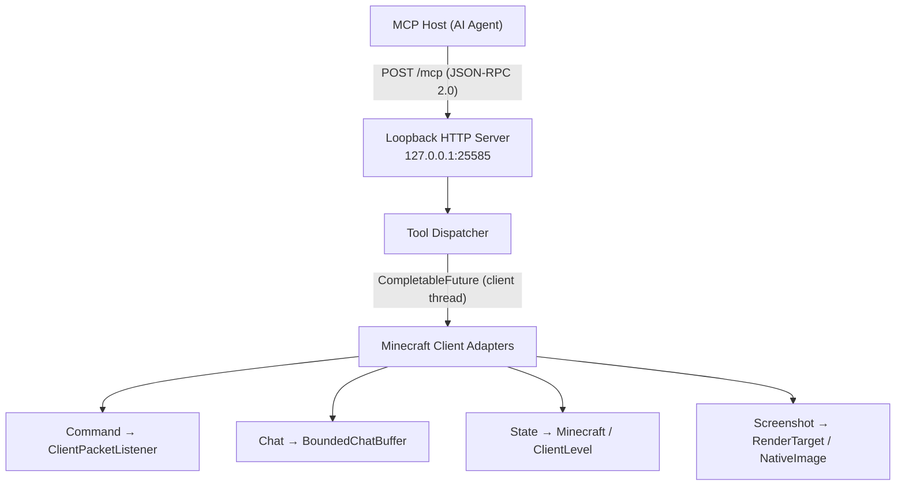

# MCMCP — Minecraft Fabric MCP Client Mod

> A pure client-side Fabric mod that embeds a local MCP server inside the Minecraft Java Edition client, letting external AI agents read chat, game state, and screenshots, and submit slash commands — without any server-side mod or plugin.

**English** | **[中文](docs/README.zh.md)**

MCMCP (Minecraft MCP) turns the running Minecraft client into a Streamable HTTP MCP server. It supports the standard initialization lifecycle used by Codex and retains its MCP 2026-07-28 discovery extensions. Any MCP Host running on the same machine can connect via loopback HTTP to observe and interact with the game in real time.

The mod is **client-only**: install it like any other Fabric mod and it starts a local HTTP server on `127.0.0.1:25585`. No server-side installation, no network exposure, no authentication tokens — just localhost.

## Table of Contents

- [Background](#background)
- [Architecture](#architecture)
- [MCP Tools](#mcp-tools)
- [Install](#install)
- [Usage](#usage)
- [Configuration](#configuration)
- [Contributing](#contributing)
- [License](#license)

## Background

The [Model Context Protocol](https://modelcontextprotocol.io/) (MCP) is an open standard for connecting AI assistants to external tools and data sources. MCMCP bridges MCP and Minecraft by exposing four tools that cover the most common agent interactions:

- **Read** what the player sees (chat messages, game state, screenshots).
- **Act** on behalf of the player (submit slash commands).

All Minecraft access happens on the client render thread to avoid race conditions. The HTTP server enforces strict loopback-only binding, origin rejection, and request limits to keep the attack surface minimal.

### Target environment

| Component | Version |
|---|---|
| Minecraft Java Edition | 26.2 |
| Fabric Loader | 0.19.4 |
| Fabric API | 0.158.0+26.2 |
| Fabric Loom (build) | 1.17.20 |
| Java | 25 |

## Architecture



For layer breakdown and security model details, see the [Contributing Guide](docs/CONTRIBUTING.md#architecture).

## MCP Tools

| Tool | Description |
|---|---|
| `minecraft_execute_command` | Submit a slash command as the current player. Returns `submitted`, not `succeeded` — read chat for server feedback. |
| `minecraft_get_chat_messages` | Read captured chat HUD messages from a bounded in-memory buffer. |
| `minecraft_get_game_state` | Get a structured snapshot of client, connection, player, world, debug, and target state. |
| `minecraft_capture_screenshot` | Capture the current window framebuffer as a PNG image. |

The server supports the standard `initialize`, `notifications/initialized`, `ping`, `tools/list`, and `tools/call` methods. The newer `server/discover` extension remains available for compatible clients.

## Install

### Prerequisites

- **Minecraft Java Edition 26.2** (installed via the official launcher or HMCL)
- **Fabric Loader 0.19.4+** — follow the [official installation guide](https://fabricmc.net/use/installer/)
- **Fabric API 0.158.0+26.2** — download from [Modrinth](https://modrinth.com/mod/fabric-api) or [CurseForge](https://www.curseforge.com/minecraft/mc-mods/fabric-api)

### Option A — Pre-built JAR

1. Download `mcmcp-0.1.0.jar` from the [releases page](https://github.com/mcmcp/mcmcp/releases).
2. Place the JAR in your Minecraft `mods` directory:
   - **Default game dir:** `~/Library/Application Support/minecraft/mods/` (macOS)
   - **Version-specific dir:** `~/Library/Application Support/minecraft/versions/26.2-Fabric/mods/` (macOS)
   - **Windows:** `%APPDATA%\.minecraft\mods\`
   - **Linux:** `~/.minecraft/mods/`
3. Launch Minecraft with the **26.2-Fabric** profile.
4. When you enter a world, you will see a chat message: `MCMCP: local programs can read chat, state, screen, and submit commands via MCP`.

### Option B — Build from source

```bash
git clone https://github.com/mcmcp/mcmcp.git
cd mcmcp

# Compile and run pure-Java unit tests (no Minecraft required)
gradle test

# Full build — produces build/libs/mcmcp-0.1.0.jar
gradle build
```

Then copy the JAR to your mods folder:

```bash
cp build/libs/mcmcp-0.1.0.jar ~/Library/Application\ Support/minecraft/mods/
```

## Usage

### Quick start

1. **Install the mod** — see [Install](#install) above.
2. **Launch Minecraft** — start the game with the **26.2-Fabric** profile and enter any world (singleplayer or multiplayer). When the world finishes loading, you will see a chat message: `MCMCP: local programs can read chat, state, screen, and submit commands via MCP`.
3. **Configure Codex** — register the local Streamable HTTP endpoint:

   ```bash
   codex mcp add mcmcp --url http://127.0.0.1:25585/mcp
   ```

   Restart or open a new Codex task after adding or updating the server so its tool inventory is refreshed.

4. **Verify the standard handshake** — send an `initialize` request and check the response:

   ```bash
   curl -s http://127.0.0.1:25585/mcp \
     -H "Content-Type: application/json" \
     -H "Accept: application/json, text/event-stream" \
     -d '{"jsonrpc":"2.0","id":1,"method":"initialize","params":{"protocolVersion":"2025-11-25","capabilities":{},"clientInfo":{"name":"curl","version":"1.0"}}}'
   ```

   A successful response includes `protocolVersion`, `capabilities`, and `serverInfo`.

### Example — call a tool

Call `minecraft_get_game_state` to read the current player and world state:

```bash
curl -s http://127.0.0.1:25585/mcp \
  -H "Content-Type: application/json" \
  -H "Accept: application/json, text/event-stream" \
  -H "MCP-Protocol-Version: 2025-11-25" \
  -d '{
    "jsonrpc": "2.0",
    "id": 1,
    "method": "tools/call",
    "params": {
      "name": "minecraft_get_game_state",
      "arguments": {"sections": ["player", "world"]}
    }
  }'
```

## Configuration

The mod reads `config/mcmcp.json` (relative to the Minecraft game directory). It is auto-generated with defaults on first launch.

```json
{
  "enabled": true,
  "port": 25585,
  "chat_buffer_size": 1000,
  "request_timeout_ms": 5000,
  "requests_per_second": 20,
  "screenshots_per_second": 1
}
```

| Field | Type | Default | Description |
|---|---|---|---|
| `enabled` | boolean | `true` | Master switch; set to `false` to disable the HTTP server |
| `port` | int | `25585` | Loopback TCP port for the MCP server |
| `chat_buffer_size` | int | `1000` | Maximum number of chat messages retained in memory |
| `request_timeout_ms` | int | `5000` | Deadline for client-thread operations in milliseconds |
| `requests_per_second` | int | `20` | Token-bucket rate limit for total MCP requests |
| `screenshots_per_second` | int | `1` | Separate rate limit for screenshot captures |

## Contributing

Contributions are welcome! See the [Contributing Guide](docs/CONTRIBUTING.md) for development setup, build commands, testing, code conventions, architecture layers, security model, and the pull request process.

## License

[Apache License 2.0](LICENSE)
