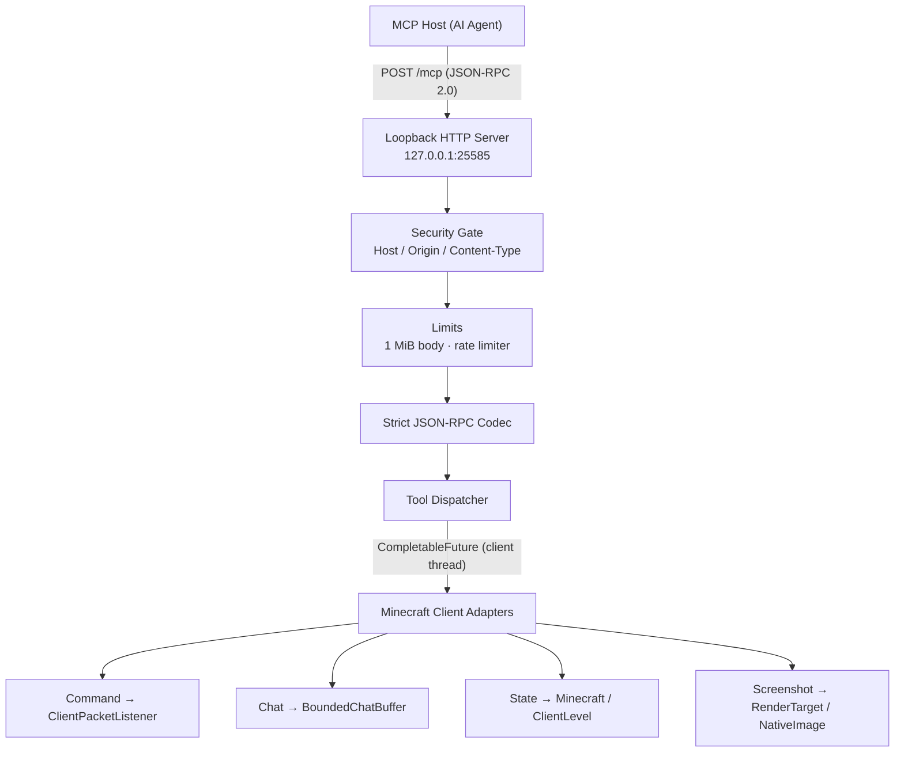

# Contributing to MCMCP

Thanks for your interest in contributing to MCMCP! This guide covers the development workflow, build commands, testing, and project conventions.

## Table of Contents

- [Development Environment](#development-environment)
- [Build](#build)
- [Testing](#testing)
- [Architecture](#architecture)
- [Project Structure](#project-structure)
- [Security Model](#security-model)
- [Code Conventions](#code-conventions)
- [Minecraft 26.2 API Notes](#minecraft-262-api-notes)
- [Pull Request Process](#pull-request-process)

## Development Environment

| Component | Version |
|---|---|
| Minecraft Java Edition | 26.2 |
| Fabric Loader | 0.19.4 |
| Fabric API | 0.158.0+26.2 |
| Fabric Loom | 1.17.20 |
| Java | 25 |
| Gradle | 9.7.1 (wrapper) |

Clone and verify the build:

```bash
git clone https://github.com/mcmcp/mcmcp.git
cd mcmcp
gradle test
gradle build
```

## Build

```bash
# Pure-Java unit tests (no Minecraft dependency)
gradle test

# Full build including client sources (requires Minecraft 26.2 + Loom 1.17)
gradle build
```

Build output: `build/libs/mcmcp-0.1.0.jar`

## Testing

### Unit tests

```bash
gradle test
```

65 pure-Java tests cover the domain, protocol, application, transport, and infrastructure layers. These do not require a Minecraft installation.

### End-to-end test

An external Python test script exercises the live MCP server against a running Minecraft client:

```bash
# 1. Launch Minecraft (auto-joins the world)
bash scripts/launch_minecraft.sh &

# 2. Wait for the client to load, then run tests
python3 scripts/test_mcmcp.py
```

The test script covers:
- `server/discover` — protocol version, capabilities, server info
- `tools/list` — all 4 tools in correct order with schemas
- `minecraft_get_game_state` — player, world, client, connection sections
- `minecraft_execute_command` — command submission
- `minecraft_get_chat_messages` — chat buffer read
- `minecraft_capture_screenshot` — PNG capture and validation
- Security: Origin rejection (403), null Origin (403), wrong Host, oversized body (413), wrong Content-Type (415)

The end-to-end test requires a local Minecraft 26.2 installation with the `26.2-Fabric` profile and an existing singleplayer world.

## Architecture



### Layers

| Layer | Source set | Dependencies | Role |
|---|---|---|---|
| Domain | `src/main/java/dev/mcmcp/domain` | JDK only | DTOs, error codes, tool definitions |
| Infrastructure | `src/main/java/dev/mcmcp/{config,chat,screenshot,util,observability}` | Gson | Config, rate limiter, chat buffer, PNG encoder |
| Protocol | `src/main/java/dev/mcmcp/protocol` | Gson | Strict JSON reader, JSON-RPC codec, MCP validator, tool catalog |
| Application | `src/main/java/dev/mcmcp/application` | Domain + Protocol | Tool handlers, dispatcher, port interfaces |
| Transport | `src/main/java/dev/mcmcp/transport` | Netty | Loopback HTTP server, security gate, dispatch handler |
| Minecraft Adapter | `src/client/java/dev/mcmcp/client` | Minecraft + Fabric | Port implementations, entrypoint |

## Project Structure

```
src/
├── main/java/dev/mcmcp/
│   ├── domain/          # DTOs, error codes, tool definitions (JDK only)
│   ├── config/          # Config loading
│   ├── chat/            # Bounded chat buffer
│   ├── screenshot/      # PixelFrame, PNG encoder
│   ├── util/            # Rate limiter, coord math, time utils
│   ├── observability/   # Logger, metrics
│   ├── protocol/        # Strict JSON reader, JSON-RPC codec, MCP validator
│   ├── application/     # Tool handlers, dispatcher, port interfaces
│   └── transport/netty/ # Loopback HTTP server, security gate
├── client/java/dev/mcmcp/client/
│   ├── McmcpClient.java             # Fabric entrypoint
│   ├── MinecraftClientScheduler.java # Client-thread task scheduler
│   ├── ClientSessionTracker.java    # Lifecycle generation tracking
│   ├── ChatListener.java            # Fabric chat event listener
│   ├── MinecraftCommandAdapter.java
│   ├── MinecraftChatAdapter.java
│   ├── MinecraftStateAdapter.java
│   ├── MinecraftScreenshotAdapter.java
│   ├── FrameCaptureGateway.java
│   └── ScreenIdMapper.java
├── main/resources/
│   ├── fabric.mod.json
│   ├── mcmcp.mixins.json
│   └── mcmcp/schema/   # JSON schemas for tool input/output
└── test/java/dev/mcmcp/  # Pure-Java unit tests
```

## Security Model

- **Loopback only:** The server binds exclusively to `127.0.0.1` (IPv4). No remote connections are possible.
- **Origin rejection:** Any request containing an `Origin` header (including `Origin: null`) is rejected with HTTP 403. This prevents browser-based access.
- **Host validation:** The `Host` header must be `127.0.0.1:<port>` or `localhost:<port>` (case-insensitive).
- **No CORS headers:** The server never emits `Access-Control-*` headers.
- **Body limit:** Request bodies larger than 1 MiB are rejected with HTTP 413.
- **No authentication:** Any local process under the same OS account can connect. This is by design — the threat model is browser-origin isolation, not local process isolation.
- **Rate limiting:** Token-bucket limiter on total requests and a separate limiter on screenshot captures.

## Code Conventions

- **Java 25** toolchain; pure-Java layers target `--release 21` where possible for reuse.
- **Mojang mappings** (not Yarn) for all Minecraft 26.2 client code.
- All Minecraft client access must happen on the **client render thread** via `MinecraftClientScheduler`.
- Screenshot capture uses **asynchronous GPU readback** — never block the render thread waiting for a callback.
- Keep the HTTP server **loopback-only**. Never add remote binding or authentication bypasses.
- Reject any request containing an `Origin` header.
- Preserve bounded request/body handling (1 MiB limit, rate limiting).
- Do not add or remove comments unless asked.
- Follow existing code style; prefer compact code over verbose nesting.

## Minecraft 26.2 API Notes

Minecraft 26.2 uses Mojang mappings. Key name differences from Yarn:

| Yarn | Mojang (26.2) |
|---|---|
| `MinecraftClient` | `Minecraft` |
| `ClientWorld` | `ClientLevel` |
| `ClientPlayerEntity` | `LocalPlayer` |
| `ClientPacketListener` (network) | `mc.getConnection()` |
| `BlockPos` package | `net.minecraft.core.BlockPos` |
| `Vec3d` | `net.minecraft.world.phys.Vec3` |
| `WorldChunk` | `LevelChunk` |
| `Text` | `Component` |
| `sendMessage` | `sendSystemMessage` |

Notable 26.2 changes:
- `Minecraft#screen` field is removed — use `mc.gui.screen()`.
- `Minecraft#setScreen(Screen)` is removed — use `mc.setScreenAndShow(Screen)`.
- `Screenshot.takeScreenshot(RenderTarget, Consumer<NativeImage>)` performs async GPU readback.
- `ChunkAccess.getStatus()` is unavailable — use `getPersistedStatus()`.
- `TagKey.key()` is unavailable — use `TagKey.location()`.

## Pull Request Process

1. Fork the repository and create a feature branch from `main`.
2. Write tests for new functionality. Pure-Java layers should have unit tests in `src/test/java/`.
3. Run `gradle test` before submitting — all tests must pass.
4. Run `gradle build` to verify the full build (including client sources) compiles.
5. Keep diffs minimal. Follow existing code style.
6. Open a pull request with a clear description of what changed and why.
7. For changes to the MCP protocol surface or security model, describe the rationale in the PR description.

## License

By contributing, you agree that your contributions will be licensed under the [Apache License 2.0](../LICENSE).
