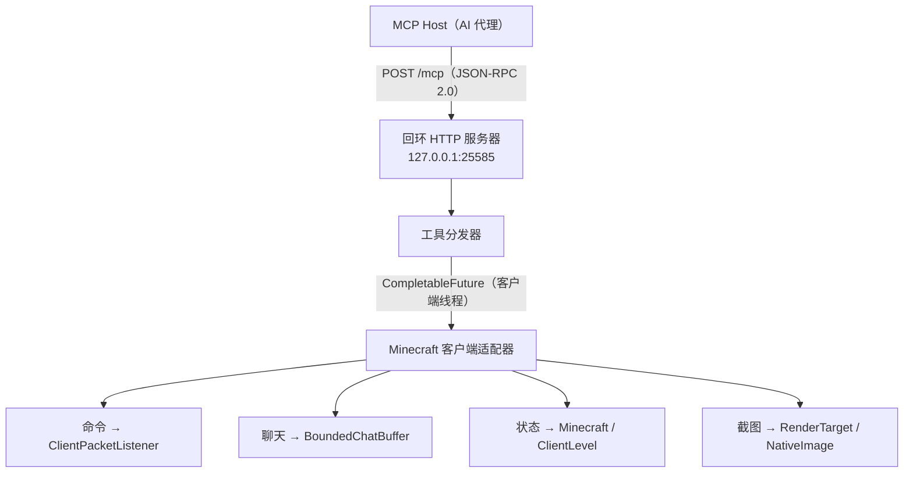

# MCMCP — Minecraft Fabric MCP 客户端模组

> 一个纯客户端 Fabric 模组，在 Minecraft Java 版客户端内嵌入本地 MCP 服务器，让外部 AI 代理读取聊天、游戏状态和截图，并提交斜杠命令 —— 无需任何服务端模组或插件。

MCMCP（Minecraft MCP）将运行中的 Minecraft 客户端变成 Streamable HTTP MCP 服务器。它支持 Codex 使用的标准初始化生命周期，同时保留 MCP 2026-07-28 发现扩展。同一台机器上的任何 MCP Host 都可以通过本地 HTTP 连接，实时观察和操作游戏。

本模组是**纯客户端**的：像安装任何其他 Fabric 模组一样安装它，它会在 `127.0.0.1:25585` 上启动一个本地 HTTP 服务器。无需服务端安装、无需网络暴露、无需认证令牌 —— 只用本地回环。

**[English](../README.md)** | **中文**

## 目录

- [背景](#背景)
- [架构](#架构)
- [MCP 工具](#mcp-工具)
- [安装](#安装)
- [使用](#使用)
- [配置](#配置)
- [贡献](#贡献)
- [许可证](#许可证)

## 背景

[模型上下文协议](https://modelcontextprotocol.io/)（MCP）是一个连接 AI 助手与外部工具和数据源的开放标准。MCMCP 通过暴露四个工具来连接 MCP 和 Minecraft，覆盖最常见的代理交互：

- **读取**玩家所见（聊天消息、游戏状态、截图）。
- **代替**玩家行动（提交斜杠命令）。

所有 Minecraft 访问都在客户端渲染线程上执行，以避免竞态条件。HTTP 服务器强制执行严格的回环绑定、Origin 拒绝和请求限制，以最小化攻击面。

### 目标环境

| 组件 | 版本 |
|---|---|
| Minecraft Java 版 | 26.2 |
| Fabric Loader | 0.19.4 |
| Fabric API | 0.158.0+26.2 |
| Fabric Loom（构建） | 1.17.20 |
| Java | 25 |

## 架构



分层详情和安全模型请参阅[贡献指南](CONTRIBUTING.md#architecture)。

## MCP 工具

| 工具 | 描述 |
|---|---|
| `minecraft_execute_command` | 以当前玩家身份提交斜杠命令。返回 `submitted`（已提交）而非 `succeeded`（已成功）—— 请读取聊天获取服务端反馈。 |
| `minecraft_get_chat_messages` | 从有界内存缓冲区读取捕获的聊天 HUD 消息。 |
| `minecraft_get_game_state` | 获取客户端、连接、玩家、世界、调试和目标状态的结构化快照。 |
| `minecraft_capture_screenshot` | 将当前窗口帧缓冲区捕获为 PNG 图像。 |

服务器支持标准的 `initialize`、`notifications/initialized`、`ping`、`tools/list` 和 `tools/call` 方法，并为兼容客户端保留较新的 `server/discover` 扩展。

## 安装

### 前置条件

- **Minecraft Java 版 26.2**（通过官方启动器或 HMCL 安装）
- **Fabric Loader 0.19.4+** — 参阅[官方安装指南](https://fabricmc.net/use/installer/)
- **Fabric API 0.158.0+26.2** — 从 [Modrinth](https://modrinth.com/mod/fabric-api) 或 [CurseForge](https://www.curseforge.com/minecraft/mc-mods/fabric-api) 下载

### 方式 A — 预构建 JAR

1. 从 [发布页面](https://github.com/mcmcp/mcmcp/releases) 下载 `mcmcp-0.1.0.jar`。
2. 将 JAR 放入你的 Minecraft `mods` 目录：
   - **默认游戏目录：** `~/Library/Application Support/minecraft/mods/`（macOS）
   - **版本专属目录：** `~/Library/Application Support/minecraft/versions/26.2-Fabric/mods/`（macOS）
   - **Windows：** `%APPDATA%\.minecraft\mods\`
   - **Linux：** `~/.minecraft/mods/`
3. 使用 **26.2-Fabric** 配置文件启动 Minecraft。
4. 进入世界后，你会看到一条聊天消息：`MCMCP: local programs can read chat, state, screen, and submit commands via MCP`。

### 方式 B — 从源码构建

```bash
git clone https://github.com/mcmcp/mcmcp.git
cd mcmcp

# 编译并运行纯 Java 单元测试（无需 Minecraft）
gradle test

# 完整构建 —— 生成 build/libs/mcmcp-0.1.0.jar
gradle build
```

然后将 JAR 复制到你的 mods 文件夹：

```bash
cp build/libs/mcmcp-0.1.0.jar ~/Library/Application\ Support/minecraft/mods/
```

## 使用

### 快速开始

1. **安装模组** — 参见上方[安装](#安装)章节。
2. **启动 Minecraft** — 使用 **26.2-Fabric** 配置文件启动游戏，进入任意世界（单人或多人）。世界加载完成后，你会看到一条聊天消息：`MCMCP: local programs can read chat, state, screen, and submit commands via MCP`。
3. **配置 Codex** — 注册本地 Streamable HTTP 端点：

   ```bash
   codex mcp add mcmcp --url http://127.0.0.1:25585/mcp
   ```

   添加或更新服务器后，重启 Codex 或新建任务以刷新工具清单。

4. **验证标准握手** — 发送 `initialize` 请求并检查响应：

   ```bash
   curl -s http://127.0.0.1:25585/mcp \
     -H "Content-Type: application/json" \
     -H "Accept: application/json, text/event-stream" \
     -d '{"jsonrpc":"2.0","id":1,"method":"initialize","params":{"protocolVersion":"2025-11-25","capabilities":{},"clientInfo":{"name":"curl","version":"1.0"}}}'
   ```

   成功响应包含 `protocolVersion`、`capabilities` 和 `serverInfo`。

### 示例 —— 调用工具

调用 `minecraft_get_game_state` 读取当前玩家和世界状态：

```bash
curl -s http://127.0.0.1:25585/mcp \
  -H "Content-Type: application/json" \
  -H "Accept: application/json, text/event-stream" \
  -H "MCP-Protocol-Version: 2025-11-25" \
  -d '{
    "jsonrpc": "2.0",
    "id": 1,
    "method": "tools/call",
    "params": {
      "name": "minecraft_get_game_state",
      "arguments": {"sections": ["player", "world"]}
    }
  }'
```

## 配置

模组读取 `config/mcmcp.json`（相对于 Minecraft 游戏目录）。首次启动时自动生成默认配置。

```json
{
  "enabled": true,
  "port": 25585,
  "chat_buffer_size": 1000,
  "request_timeout_ms": 5000,
  "requests_per_second": 20,
  "screenshots_per_second": 1
}
```

| 字段 | 类型 | 默认值 | 描述 |
|---|---|---|---|
| `enabled` | 布尔值 | `true` | 主开关；设为 `false` 禁用 HTTP 服务器 |
| `port` | 整数 | `25585` | MCP 服务器的回环 TCP 端口 |
| `chat_buffer_size` | 整数 | `1000` | 内存中保留的最大聊天消息数 |
| `request_timeout_ms` | 整数 | `5000` | 客户端线程操作的超时时间（毫秒） |
| `requests_per_second` | 整数 | `20` | 总 MCP 请求的令牌桶速率限制 |
| `screenshots_per_second` | 整数 | `1` | 截图捕获的独立速率限制 |

## 贡献

欢迎贡献！请参阅[贡献指南](CONTRIBUTING.md)了解开发环境、构建命令、测试、代码规范、架构分层、安全模型和 PR 流程。

## 许可证

[Apache License 2.0](../LICENSE)
